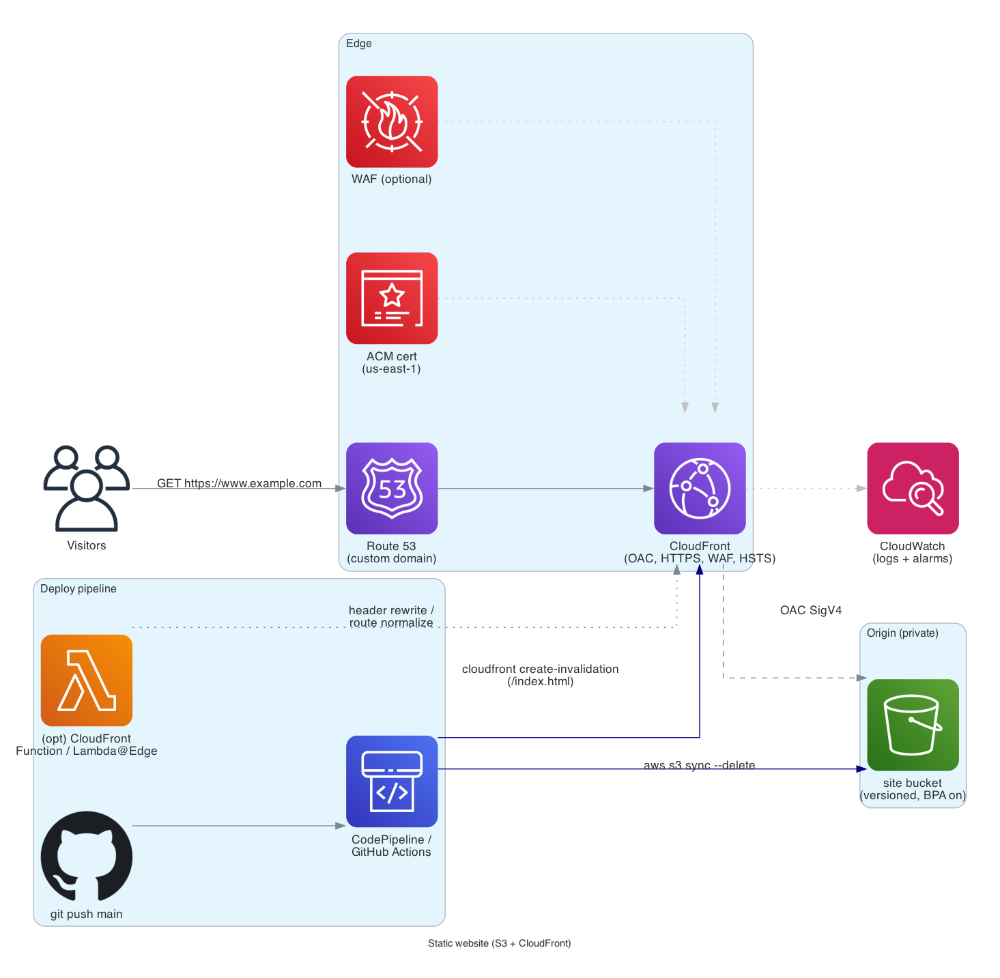

# Static website: S3 + CloudFront

> **One-line summary.** Marketing sites, docs, SPAs (React/Vue/Svelte), or pre-rendered Next.js exports — served from S3 behind CloudFront with HTTPS, custom domain, and atomic deploys via versioned object keys or `aws s3 sync`.

## TL;DR
- The cheapest, fastest way to serve a static site on AWS. Pennies per month for typical traffic.
- **S3** holds the rendered files (HTML/CSS/JS/images). **CloudFront** caches globally and serves over HTTPS. **Route 53 + ACM** for custom domain + TLS.
- Use **Origin Access Control (OAC)** so S3 is private — direct S3 URLs return 403; only CloudFront can read.
- Deploys: `aws s3 sync ./dist s3://bucket/ --delete` + CloudFront **invalidation** for changed paths (or cache-bust via fingerprinted filenames).
- Single-page apps need CloudFront to route 404s → `/index.html` so client-side routing works.

## When to use it
- Marketing / brochure sites.
- Documentation sites (Docusaurus, MkDocs, Hugo).
- React / Vue / Svelte / Solid SPAs.
- Pre-rendered Next.js / Nuxt / Astro exports (no SSR).
- Customer / partner-facing static portals.
- Internal docs sites (with Cognito at the edge for auth).

## When NOT to use it
- Server-rendered apps that need per-request compute — use **Lambda@Edge / CloudFront Functions** for light personalization, or **Amplify Hosting** / **App Runner** for Next.js SSR.
- APIs — use [serverless-rest-api](serverless-rest-api.md) instead.
- Apps with significant build-time data fetching from authenticated APIs — consider an SSR setup.

## Functional Requirements
- Serve static assets globally over HTTPS.
- Custom domain (`www.example.com`).
- Cache aggressively at the edge.
- Atomic deploys: never serve partially-updated content.
- SPA support: deep links route to `/index.html`.
- Cache invalidation on deploy.

## Non-Functional Requirements
- **Latency**: p99 < 200 ms globally (CDN edge).
- **Availability**: 99.99%.
- **Throughput**: scales transparently to billions of req/day via CloudFront.
- **Cost**: < $10/month for sites under 1 TB/month of egress.

## High-Level Architecture



User → **Route 53** → **CloudFront** (TLS via **ACM** cert in `us-east-1`) → **OAC** → private **S3** bucket. CI (CodePipeline / GitHub Actions) syncs the build artifact to S3 + invalidates CloudFront on deploy.

## Detailed components

### S3 bucket
- **Private** (Block Public Access on at the account level).
- Object versioning **on** for rollback.
- Standard storage class (Intelligent-Tiering doesn't help for hot static sites).
- Bucket policy allows only the CloudFront distribution's OAC principal.

### CloudFront distribution
- **Origin** = the S3 bucket via OAC.
- **Default root object**: `index.html`.
- **Custom error responses**: 403 / 404 → return `index.html` with HTTP 200 (for SPA routing).
- **Cache policy**: long TTL for fingerprinted assets (`*.[hash].js`); short TTL for `index.html`.
- **Compression** enabled.
- **HTTP/2 + HTTP/3** on.
- **Custom headers** via response-headers policy (HSTS, CSP, X-Frame-Options).
- **Geo restrictions** if applicable.
- **WAF** attached for any internet-facing site (catches bots / scrapers).

### ACM cert
- In `us-east-1` (CloudFront requirement).
- DNS validation via Route 53 (zero-touch renewal).

### Deploy pipeline
```sh
# Build
npm run build

# Sync (delete removes orphaned files)
aws s3 sync ./dist s3://my-site-bucket/ \
  --delete \
  --cache-control "public, max-age=31536000, immutable" \
  --exclude "index.html" \
  --exclude "*.json"

# index.html and JSON manifests with short cache
aws s3 cp ./dist/index.html s3://my-site-bucket/ \
  --cache-control "public, max-age=60, must-revalidate"

# Invalidate
aws cloudfront create-invalidation \
  --distribution-id ABCDEF \
  --paths "/index.html" "/manifest.json"
```

Fingerprinted asset names (`app.a3f8c.js`) mean asset URLs are unique per version → cache-by-filename works perfectly → no asset invalidation needed.

### Deploy strategies
- **In-place sync + invalidate**: simple; brief window of inconsistency between fingerprinted assets and the new `index.html`. Acceptable for most sites.
- **Atomic deploy via key prefix**: upload to `v2/`, flip the CloudFront origin path to `v2/` only after upload completes. Zero-window cutover. Requires CloudFront update on each deploy.
- **Blue/green CloudFront** (continuous deployment): use CloudFront's continuous-deployment policy to route a slice of traffic to a staging distribution. Best for high-traffic sites.

### Edge customization (optional)
- **CloudFront Functions** (sub-millisecond JS) for header rewrites, URL normalization, A/B test routing.
- **Lambda@Edge** (millisecond-scale, full Node/Python) for richer logic (token validation, dynamic personalization).

## Cost Notes
For a typical site (10 GB stored, 100 GB egress/month):
- **S3**: ~$0.25/month.
- **CloudFront egress**: ~$8.50/month (price varies by Region).
- **CloudFront requests**: ~$0.50/month.
- **Route 53**: $0.50/month per hosted zone.
- **ACM cert**: free.

**Total: ~$10/month** for the example site. Scales linearly with egress.

Levers:
- **CloudFront price class** (limit edges to specific Regions = cheaper).
- **Brotli compression** (smaller payloads = lower egress).
- **Image optimization** (WebP/AVIF, responsive srcset).
- **Long TTL on fingerprinted assets** (immutable, max cache time).

## Failure modes
- **S3 AZ failure**: transparent (S3 is multi-AZ).
- **Region failure**: CloudFront serves from cache for cached paths; uncached requests fail. Cross-Region replicate the bucket and switch origin manually (or use Multi-Origin Failover for automated).
- **Bad deploy**: roll back by re-syncing the previous build (S3 versioning helps). CloudFront invalidation needed.
- **DDoS**: Shield Standard absorbs; consider Shield Advanced for high-profile sites.

## CI/CD integration
Typical pipeline (CodePipeline or GitHub Actions):
1. Trigger on push to `main`.
2. Run tests + build.
3. `aws s3 sync` with appropriate cache headers.
4. `aws cloudfront create-invalidation` for `/index.html` and JSON manifests.
5. (Optional) Smoke test against the live URL.
6. (Optional) Notify Slack on success/failure.

Authentication via **OIDC federation** from CI (no static AWS keys).

## Alternatives & trade-offs
- **Amplify Hosting** — managed equivalent (branch-based deploys, atomic, built-in SSR for Next.js). Trade: less control, higher cost than DIY S3+CloudFront.
- **Vercel / Netlify / Cloudflare Pages** — competing managed offerings. Pick based on integration / team familiarity.
- **EC2 + nginx** — never. Use this stack.
- **S3 static website hosting (without CloudFront)** — works but no HTTPS on the apex domain without a workaround; missing the CDN; almost never the right choice.

## Further reading
- [Hosting a static website on S3](https://docs.aws.amazon.com/AmazonS3/latest/userguide/WebsiteHosting.html).
- [CloudFront Origin Access Control](https://docs.aws.amazon.com/AmazonCloudFront/latest/DeveloperGuide/private-content-restricting-access-to-s3.html).
- [CloudFront cache policies and origin request policies](https://docs.aws.amazon.com/AmazonCloudFront/latest/DeveloperGuide/working-with-policies.html).
- Related: [S3 service page](../01-services/storage/s3.md), [CloudFront service page](../01-services/networking/cloudfront.md), [serverless-rest-api](serverless-rest-api.md).
