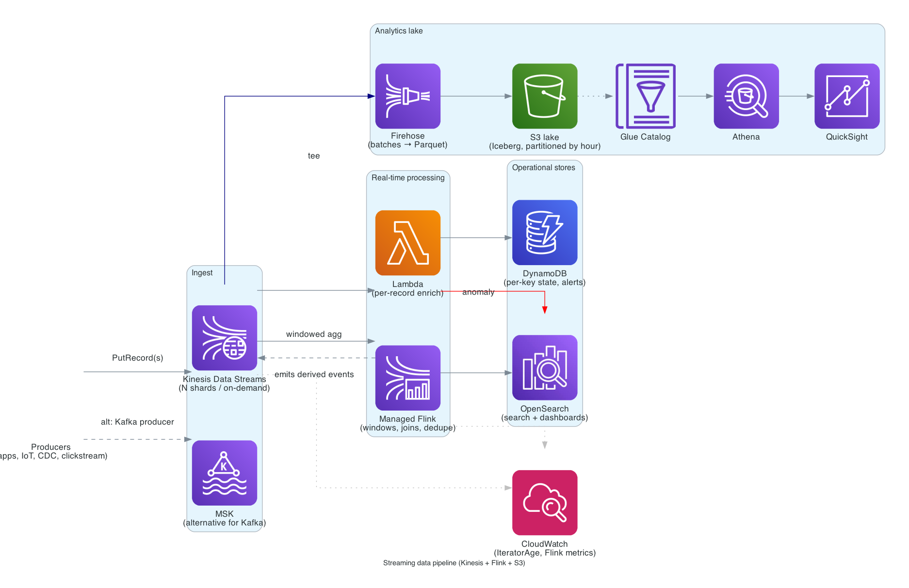

# Streaming data pipeline

> **One-line summary.** Producers → Kinesis Data Streams (or MSK) → Lambda for per-record work + Managed Flink for windowed aggregation → OpenSearch / DynamoDB for hot lookups + S3 (via Firehose) for the lake. The default real-time analytics shape on AWS.

## TL;DR
- **Kinesis Data Streams** (KDS) is the default ordered, durable, replayable log. Use **MSK** when you specifically need Kafka semantics or Kafka tooling.
- **Lambda** handles per-record stateless work (enrichment, filtering, alerting). **Managed Service for Apache Flink** handles stateful streaming (windows, joins, deduplication).
- **Firehose** is the cheap, easy way to land everything in S3 as Parquet for the analytics lake. Tee from the same stream — don't try to make hot consumers do this job.
- **DynamoDB** for per-key state (last value, counters); **OpenSearch** for search, dashboards, and anomaly UIs.
- Backpressure, replay, ordering per key, and exactly-once-ish semantics are explicit design decisions — the AWS primitives give you the levers.

## When to use it
- Clickstream / product analytics in near real time.
- Application + infrastructure log analytics.
- Real-time fraud / anomaly detection (with windowed aggregates).
- CDC (DB change capture) into downstream systems.
- IoT telemetry processing.
- Any workload where the answer must be visible in seconds rather than minutes.

## When NOT to use it
- Batch ETL — use [data-lake-on-s3](data-lake-on-s3.md) with Glue jobs / EMR.
- Pure pub-sub event routing — use [event-driven-architecture](event-driven-architecture.md) with EventBridge.
- Tiny throughput (< 100 events/sec sustained) — a Lambda triggered by SQS or EventBridge is simpler and cheaper.

## Functional Requirements
- Ingest events from many producers at high throughput.
- Process per-record (enrich, validate, alert) and over windows (1-min, 5-min counts; sliding averages; sessionization).
- Land all raw events durably for replay and historical analysis.
- Serve real-time queries from operational stores (DynamoDB, OpenSearch).
- Replay history into a new consumer without disturbing existing ones.

## Non-Functional Requirements
- **Throughput**: 1 KB record × 1000 records/sec ≈ 1 MB/s per shard (KDS write limit). Scale by shard count or **on-demand mode** (autoscales, 4 GB/s default).
- **Latency**: producer → consumer typically 200 ms – 2 s. Sub-200 ms only with **Enhanced Fan-Out** (HTTP/2 push) consumers.
- **Retention**: KDS up to 365 days; default 24 hours.
- **Durability**: synchronous replication across 3 AZs per stream.
- **Ordering**: per partition key.

## High-Level Architecture

**Producers** call `PutRecord` / `PutRecords` against **Kinesis Data Streams** (or write to **MSK** if Kafka is required). Two parallel consumption paths:
- **Hot path**: **Lambda** does per-record enrichment / alerting, writing to **DynamoDB** for per-key state and surfacing anomalies to **OpenSearch**. **Managed Flink** runs stateful windowed aggregations and pushes derived events back to KDS or to OpenSearch.
- **Cold path**: **Firehose** tees from KDS, buffers (60s / 128 MB), converts to **Parquet**, partitions by date/hour, and lands in **S3**. The lake is queried by **Athena** via the **Glue Data Catalog** and visualized in **QuickSight**.

## Detailed components

### Ingest (Kinesis Data Streams)
- **On-demand mode** for unpredictable load (autoscales, no shard math; 4 GB/s baseline, request quota for more).
- **Provisioned mode** for steady predictable load — cheaper per byte but you manage shards.
- **Partition key** strategy: pick a high-cardinality key (`userId`, `deviceId`) to spread writes. Hot keys cause shard hot spots — KDS has `LIST_SHARDS` / `MergeShard` / `SplitShard` to re-shard.
- **Producers**: use the **KPL** (Java) or **boto3 with batched `PutRecords`** in other languages. Compress payloads.
- **Server-side encryption** with KMS by default.
- **Retention**: bump from 24 h to 7+ days for safety on consumer outages.

### Ingest alternative (MSK)
- Use when: existing Kafka producers/consumers, need Kafka Streams / kSQL / Connect, or 1 ms-class produce-to-consume latency.
- **MSK Serverless** is the lowest-friction option; **MSK provisioned** for fine-grained control.
- More operational surface than KDS — choose it for a reason, not by default.

### Hot path — Lambda
- Triggered by **KDS event source mapping** (poll-based) or **enhanced fan-out** (push, dedicated 2 MB/s per consumer).
- **Batch size**: tune for throughput vs latency (default 100; up to 10,000).
- **Parallelization factor** (1-10) to run multiple Lambdas per shard.
- **`reportBatchItemFailures`** to partial-fail and avoid re-processing the whole batch.
- **Iterator age** is the key metric — rising age = consumer falling behind.

### Hot path — Managed Flink
- For **stateful** stream processing: windows (tumbling, sliding, session), joins between streams, deduplication, complex event processing, materialized views.
- **Studio notebooks** for interactive SQL development; promote to applications.
- **Checkpoints** to S3 every minute or so; recover state on failure.
- **Autoscaling** on KPU (Kinesis Processing Unit) based on `containerCPUUtilization`.
- Emits derived events back to KDS, or sinks directly to OpenSearch / S3 / Timestream.

### Operational stores
- **DynamoDB**: per-key state (last seen, running totals, last alert timestamp), idempotency keys for deduplication, fast point lookups from APIs. **On-demand** capacity for spiky writes.
- **OpenSearch**: full-text search, dashboards (OpenSearch Dashboards), anomaly detection, alerting. Sized for retention × write rate — typically a few terabytes hot, with **UltraWarm / cold tier** for older indices.

### Cold path — Firehose + S3 + Athena
- **Firehose** delivery stream consumes from KDS (or direct PUT from producers).
- **Dynamic partitioning** by event attribute (e.g., `tenantId/yyyy/MM/dd/HH/`).
- **Parquet conversion** in Firehose (saves 70–90% storage vs JSON) via a Glue table schema.
- **Buffering hints**: 64-128 MB / 60-300 s.
- **S3** with lifecycle: hot → IA after 30 d → Glacier IR after 90 d, depending on access pattern.
- **Glue Catalog** with crawler or schema registry.
- **Athena** for ad-hoc SQL; **QuickSight** for dashboards.
- For the full lake see [data-lake-on-s3](data-lake-on-s3.md).

### Observability
- **CloudWatch metrics**: `GetRecords.IteratorAgeMilliseconds` (consumer lag), `IncomingBytes`, `IncomingRecords`, `WriteProvisionedThroughputExceeded`, Lambda `Errors`/`Throttles`, Flink `lastCheckpointDuration`, Firehose `DeliveryToS3.Success`.
- **Alarms**: iterator age > some SLA threshold, throughput exceeded errors, Firehose delivery failures.
- **X-Ray** for end-to-end trace (limited propagation through Kinesis; tag records with trace IDs and reassemble in OpenSearch).

## Cost Notes
Indicative cost for ~1 KB records at 10K records/sec sustained (~1 TB/day):
- **KDS on-demand**: ~$0.04 per GB ingested + $0.04/hour per shard ≈ ~$1000-2000/month at this rate.
- **Firehose**: $0.029/GB → ~$900/month at 30 TB.
- **Managed Flink**: ~$0.11/KPU-hour × ~4 KPUs ≈ ~$320/month.
- **Lambda**: depends; ~$200-1000/month at this scale.
- **OpenSearch**: depends on retention; small clusters $200/month, big ones thousands.
- **S3**: storage + Parquet → tens of $/month/TB.

**Order of magnitude: low thousands of $/month at 10K records/sec.**

Levers:
- **KDS provisioned + reserved shards** if load is steady.
- **Compress payloads** at the producer (gzip / snappy) — KDS counts compressed bytes against quota.
- **Firehose Parquet** is a huge cost win for downstream Athena scans.
- **Push transient state into DynamoDB / OpenSearch** rather than holding it in Flink — easier to scale and recover.

## Failure modes
- **Producer throughput burst**: KDS returns `ProvisionedThroughputExceededException`. Producers must retry with backoff; use on-demand mode for spiky loads.
- **Hot partition key**: one shard maxed while others idle. Detect via `IncomingRecords` per shard. Fix: change partition key strategy, or pre-shard with a random suffix and re-aggregate downstream.
- **Consumer lag**: iterator age climbs. Scale Lambda concurrency / Flink KPUs, increase parallelization factor, or shed load.
- **Poison record**: bisect the batch (parallelization factor + partial failure), or skip past with an explicit handler and route to a DLQ.
- **Flink job crash**: app restarts from last checkpoint; data between checkpoints replays from KDS — consumers must be idempotent.
- **Region outage**: KDS is single-Region. For DR, cross-Region replication via a Lambda that mirrors records, or producer-side dual-write.

## Migration / adoption
1. Tee from an existing system: send a copy of events to KDS without removing the original path.
2. Stand up Firehose → S3 first; cheap, builds the lake immediately.
3. Add Lambda consumers one at a time for hot paths.
4. Add Flink only when windowed state shows up in requirements.
5. Turn off the old path.

## Alternatives & trade-offs
- **MSK vs KDS**: MSK for Kafka API compatibility / ecosystem; KDS for simpler operations and tighter AWS integration.
- **EventBridge** for low-rate, attribute-routed events with many target types — but no replay window beyond archive, no per-key ordering.
- **DynamoDB Streams + Lambda** for CDC of a single DynamoDB table. EventBridge Pipes can polyfill richer transforms.
- **Timestream / Timestream for InfluxDB** as a downstream sink for time-series specifically (alternative to OpenSearch for metrics).

## Further reading
- [Streaming data on AWS (architecture center)](https://aws.amazon.com/streaming-data/).
- [Kinesis Data Streams developer guide](https://docs.aws.amazon.com/streams/latest/dev/).
- [Amazon Managed Service for Apache Flink](https://docs.aws.amazon.com/managed-flink/latest/java/).
- [Best practices for Kinesis Data Firehose](https://docs.aws.amazon.com/firehose/latest/dev/best-practices.html).
- Related: [Kinesis](../01-services/analytics/kinesis.md), [MSK](../01-services/analytics/msk.md), [OpenSearch](../01-services/analytics/opensearch.md), [data-lake-on-s3](data-lake-on-s3.md), [data-warehouse-redshift](data-warehouse-redshift.md), [event-driven-architecture](event-driven-architecture.md).
