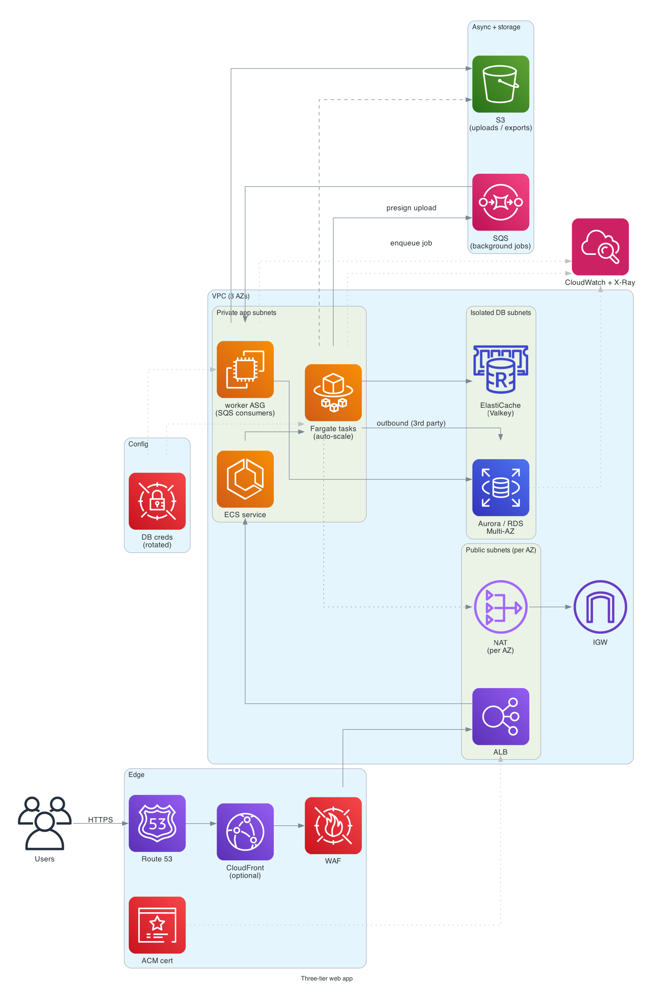

# Three-tier web app

> **One-line summary.** Classic web tier + app tier + database tier on AWS — Multi-AZ for HA, autoscaling under load, and the AWS-equivalents of the patterns that have powered every web app since the 2000s.

## TL;DR

- **Web tier**: ALB receives traffic; serves static via CloudFront or directly via the app tier.
- **App tier**: Auto Scaling Group of EC2 or **ECS Fargate** service running the app. Stateless.
- **Database tier**: **RDS** or **Aurora** Multi-AZ for transactional store; **ElastiCache** for session / hot data cache.
- Lives in a **VPC** spanning at least 3 AZs (public subnets for ALB, private subnets for app + DB).
- The "right answer" for monolithic or modular-monolith apps (Rails, Django, Spring, ASP.NET) that need a familiar SQL DB. Cheaper and simpler than microservices at small / medium scale.

## When to use it

- Greenfield or lift-and-shifted monolith / modular monolith.
- App that needs SQL + transactions, sessions, cookies — the standard CRUD app shape.
- Teams that prefer "one app, one DB" over many small services.
- Workloads where the team is more comfortable with VMs than serverless.

## When NOT to use it

- Event-driven / serverless-shaped apps — use [serverless-rest-api](serverless-rest-api.md).
- Microservices fleet — use [containerized-microservices-ecs](containerized-microservices-ecs.md) or [kubernetes-on-eks](kubernetes-on-eks.md).
- Static sites — use [static-website-s3-cloudfront](static-website-s3-cloudfront.md).
- Workloads that can scale to zero (sporadic traffic) — Lambda is cheaper.

## Functional Requirements

- Serve HTTP / HTTPS to public users.
- Auth, sessions, CRUD on relational data.
- Background jobs (emails, exports, async work).
- File uploads.
- Admin interface.

## Non-Functional Requirements

- **Latency**: p99 < 500 ms for typical pages.
- **Availability**: 99.95%+ (Multi-AZ).
- **Throughput**: scales horizontally via ASG / Fargate task count.
- **Recovery**: RTO < 1 hour, RPO < 5 min via RDS automated backups.

## High-Level Architecture

**VPC** with 3 AZs. **Public subnets** host **ALB**. **Private app subnets** host the app tier (**Auto Scaling Group of EC2** or **ECS Fargate service**). **Isolated DB subnets** host **RDS / Aurora Multi-AZ**. **ElastiCache** (Valkey) for sessions / cache. **CloudFront** in front for global edge. **NAT Gateway** (per AZ) for outbound traffic from the app tier.

## Detailed components

### Networking

- VPC with `/16` CIDR.
- 3 AZs minimum.
- Per AZ: public subnet (`/24`), private app subnet (`/22`), isolated DB subnet (`/24`).
- **Internet Gateway** for public subnet egress.
- **NAT Gateway per AZ** for app subnets' outbound (or use VPC Endpoints to avoid NAT for AWS-service traffic).
- **Security groups**: ALB SG → app SG → DB SG → ElastiCache SG. Each layer only accepts from the previous.

### Web tier (ALB)

- **Application Load Balancer** in public subnets across 3 AZs.
- **ACM cert** for HTTPS.
- **WAF** attached for rate limiting / bot protection.
- **Listener rules**: route by host / path to target groups.
- **Health checks** at `/healthz` (or app-specific).
- **Sticky sessions** off (app should be stateless; sessions in ElastiCache).

Optionally **CloudFront** in front of ALB for global edge + cache + Shield + WAF.

### App tier (compute choice)

**Option A: EC2 Auto Scaling Group**

- Launch template with AMI baked by **EC2 Image Builder**.
- Instance type: M / C / R family by workload; Graviton (Mxg) by default.
- **Min / desired / max** sized for expected load.
- **Target-tracking scaling** on CPU or ALB request count.
- **Health check** at the instance level; ASG replaces unhealthy.
- **Spot instances** for non-critical workloads (or mixed instances policy).

**Option B: ECS Fargate (recommended for new builds)**

- ECS service with **Fargate launch type** or capacity providers (Fargate + Fargate Spot mix).
- One task per app process; ALB target group attached.
- Auto-scaling on ALB request count / CPU.
- **ECS Express Mode** for the simplest case (one command provisions the whole stack).

**Option C: Elastic Beanstalk**

- Highest-abstraction; AWS manages the EC2 + ALB + scaling for you.
- Good for "I have a Django app, I want it running" — less control.

### Database tier

- **RDS** (Postgres / MySQL / SQL Server / Db2) **Multi-AZ** for HA.
- Or **Aurora** (Postgres-compatible / MySQL-compatible) — better failover, read replicas with low lag.
- For new apps, **Aurora Serverless** with scale-to-zero is the right cost-aware default.
- **Encryption at rest** (KMS).
- **Automated backups** + **PITR** (35-day window).
- **Read replicas** for scaling reads (1-15).
- **RDS Proxy** in front for Lambda / serverless callers (connection pooling).

### Cache tier

- **ElastiCache for Valkey** (recommended over Redis OSS as of 2026).
- Sessions, query results, computed views.
- Multi-AZ with at least one replica.

### Storage

- **S3** for file uploads, exports, attachments.
- **EFS** if the app tier needs a shared POSIX filesystem (rare; usually S3 + a thin wrapper is better).

### Background jobs

- **SQS** queue for async work.
- Workers in another ASG / ECS service consuming the queue.
- Or **Lambda** triggered by SQS for serverless workers.
- **EventBridge Scheduler** for cron-style.

### Secrets + config

- **Secrets Manager** for DB credentials (with auto-rotation).
- **Parameter Store** for non-secret config.
- App reads at startup; cached locally.

### Observability

- **CloudWatch Logs** for app logs (Fluent Bit on ECS, CloudWatch agent on EC2).
- **CloudWatch Metrics** + **Application Signals** for auto-USE/RED.
- **X-Ray** for distributed tracing.

## Cost Notes

Indicative monthly cost for a small production app (3 AZ, ~5 small Fargate tasks, `db.t4g.medium` RDS Multi-AZ, ~10 GB DB, modest traffic):

- **Fargate**: ~$70-150/month.
- **RDS Multi-AZ** `db.t4g.medium`: ~$130/month.
- **ALB**: ~$25/month.
- **NAT Gateway** × 3: ~$100/month (significant).
- **ElastiCache** (single small node): ~$30/month.
- **CloudFront / S3 / data transfer**: ~$10-30/month.

**Typical small-production cost: $400-600/month**, dominated by RDS + NAT.

Levers:

- **NAT instances** instead of NAT Gateway for low-traffic.
- **Single-AZ NAT** with cross-AZ acceptance (cheaper, less HA).
- **VPC Endpoints** to avoid NAT egress for S3 / DynamoDB / Secrets Manager.
- **Aurora Serverless** scale-to-zero for non-prod environments.
- **Spot** Fargate / EC2 for fault-tolerant workers.

## Failure modes

- **EC2 / Fargate instance failure**: ASG / ECS replaces; ALB drops from target group during health-check window.
- **AZ failure**: ALB and ASG / ECS multi-AZ; RDS Multi-AZ failover takes 30-120 s; user impact is brief.
- **RDS primary failure**: Multi-AZ failover (or use Aurora Multi-AZ DB cluster for ~35 s failover with readable standbys).
- **Region failure**: cross-Region replica + Route 53 failover (warm standby — see [multi-region-active-passive pattern](../02-patterns/multi-region-active-passive.md)).
- **Cache cluster failure**: app falls through to DB (with a degraded-performance window); ElastiCache failover restores.

## CI/CD

- Source → build → test → deploy.
- **CodePipeline** or **GitHub Actions** with **OIDC** to AWS.
- **CodeDeploy** for blue/green ECS deploys (alarm-driven rollback).
- **Database migrations** as a pipeline step (Liquibase / Flyway / Alembic / Rails migrations).
- Per-environment deploys: dev → staging → prod (with manual approval gate).

## Alternatives & trade-offs

- **EC2 vs Fargate**: Fargate has no instance management; EC2 is cheaper at sustained high utilization with Spot.
- **RDS vs Aurora**: Aurora has better availability, faster failover, more readers, more expensive base.
- **DIY vs Elastic Beanstalk**: EB is faster to ship for a single app; DIY gives more control and is the right call for any team that will operate multiple apps long-term.
- **Three-tier vs serverless**: three-tier when you need a long-lived process / persistent connections / framework constraints; serverless when load is bursty / lumpy.

## Further reading

- [AWS Well-Architected — Reliability Pillar](../05-well-architected/reliability.md).
- [VPC design best practices](https://docs.aws.amazon.com/whitepapers/latest/building-scalable-secure-multi-vpc-network-infrastructure/welcome.html).
- [RDS Multi-AZ vs Multi-AZ DB cluster](https://docs.aws.amazon.com/AmazonRDS/latest/UserGuide/multi-az-db-clusters-concepts.html).
- Related: [VPC](../01-services/networking/vpc.md), [ALB](../01-services/networking/elb.md), [RDS](../01-services/database/rds.md), [Aurora](../01-services/database/aurora.md), [ECS](../01-services/compute/ecs.md), [ElastiCache](../01-services/database/elasticache.md).
